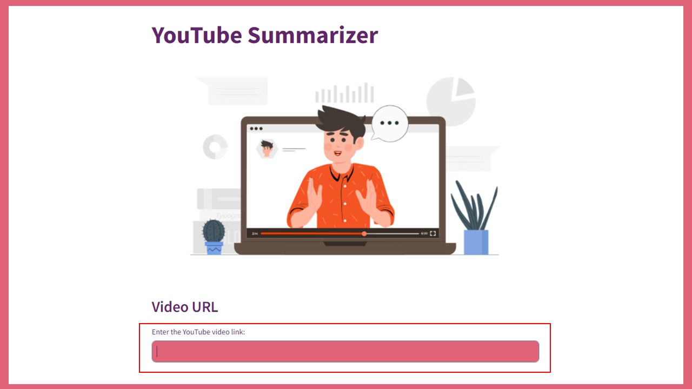

## YouTube Summarizer

### Background
Video content has become a dominant medium for information dissemination and entertainment. YouTube, as one of the largest video-sharing platforms, hosts an immense variety of content ranging from educational lectures, news, and tutorials to entertainment. However, the sheer volume of content can be overwhelming for users who may not have the time to watch lengthy videos. A solution to this problem is a web application that leverages the capabilities of large language models to generate concise summaries of YouTube video transcripts. This application aims to provide users with quick, comprehensive overviews of video content, saving them time and enhancing their content consumption experience.

### Potential Use Cases
- Students and educators can quickly review the key points of educational videos, making it easier to study or prepare lesson plans without needing to watch the entire video.
- Business professionals and analysts can use the summaries to quickly gather insights from industry-related videos, keeping them abreast of market trends and competitor activities.
- Content creators and curators can efficiently gather ideas and information from various videos, helping them produce more informed and relevant content for their audiences.
- For users with hearing impairments, the application can provide text summaries of video content, making information more accessible.
- Busy professionals and casual viewers can manage their time better by reading video summaries, allowing them to decide whether to watch the full video based on the summarized content.

⏩ <a href="https://shihjen-youtube-summarizer-app-m6seph.streamlit.app/">Web Application<a>

🎥 <a href="https://youtu.be/pZJ543VovT0">Demo Video<a>

